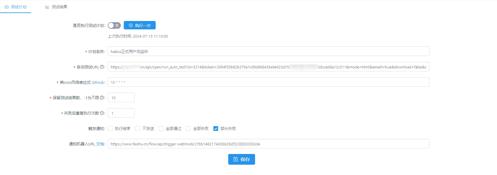
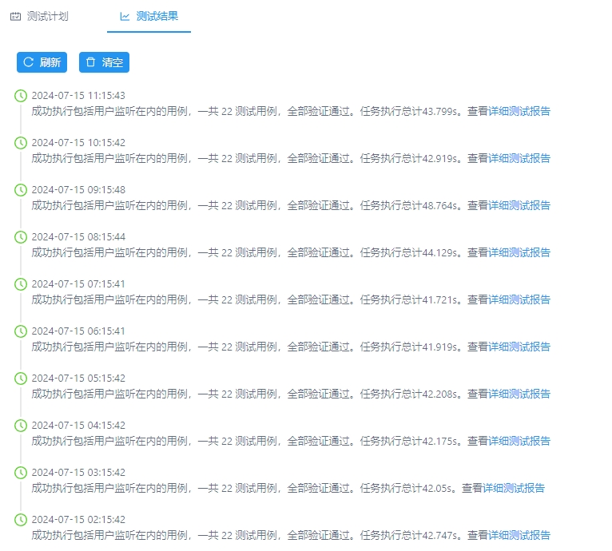
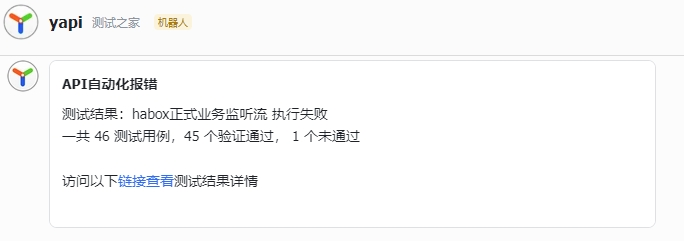

# 自动化测试计划

对于稳定流程或需要持续集成的业务测试集，若每次进行手动点击成功过高，系统提供了持续集成通过cron定时任务进行测试，保证稳定性。

## 第一步，新建计划
使用 YApi 自动化测试计划，第一步需要进行计划的创建。

## 第二步，编辑测试计划

## 第三步，查看报告
详细测试报告可查看详情

## 推送报告

### 配置webhook地址根据触发条件可推送通知

