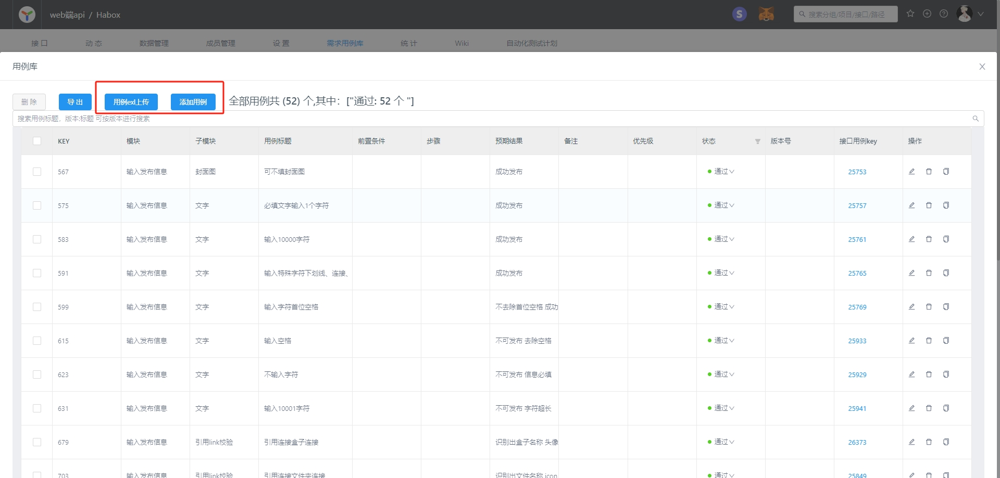

# 用例库关联

对于接口测试的覆盖率此系统的方案是基于统计和用例库衍生。用例库可添加/导入接口测试用例，并关联上系统中的用例进行通过率统计

## 第一步，添加需求
对于每个版本或模块建议分批管理用例，这里以需求的模式分批

## 第二步，添加用例

## 第三步，关联case
可在用例库进行管理也可在接口用例处进行关联。key为id，测试执行后会自动更新这里的用例状态，从而进行统计和导出

