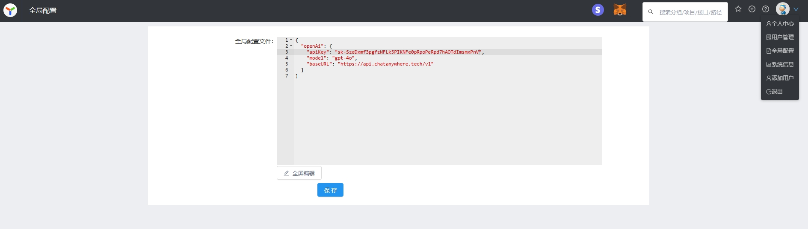

# 项目操作

## 基本设置

- tag 信息：可自定义tag名称和tag描述，tag信息可用在接口tag标识中;
- mock 严格模式：开启后 mock 请求会对 query，body form 的必须字段和 json schema 进行校验;
- 开启json5：开启后允许接口请求body 和返回值中写 json 字段。yapi建议用户关闭 json5， 因为json-schema 格式可以进行接口格式校验。


## 全局配置

- 此处可配置一些全局配置，目前仅支持openapi相关配置



## 新建项目

点击右上角的 `+` 新建项目，进入新建项目页面。


在新建项目页，填写项目信息：

> - 项目名称不允许重复，包括其他分组
> - 基本路径为接口统一添加了前缀
> - 新建项目页只列出了部分配置，其他详细配置(环境配置、项目图标等)需要进入项目页的“设置”面板进行配置。


## 修改项目

在项目页点击上方的 `设置` Tab 进入项目设置面板，这个面板涵盖了项目的所有配置。


这里比新建项目页面新增的功能如下：

### 修改项目图标

点击项目图标，可以修改图标及背景色：


## 项目迁移

YApi 中支持项目迁移到不同的分组中。


迁移权限： 只有管理员和该项目的 owner 有权限对位置进行修改。项目 owner 主要有创建该项目的人、项目中的组长、创建分组的人、分组中的组长。

> Tips: owner 权限判断的优先级是 项目权限 > 分组权限

## 项目拷贝

该功能在 v1.3.12 版本上线，项目克隆功能可复制项目全部接口到一个新项目，如下图所示,点击红色框里面的 icon 使用。

YApi 支持项目复制功能，但是无法复制项目中的测试集合 list。

操作： 点击下图左上角的复制按钮，在弹窗中写入复制项目名称点击确定就可以完成项目复制


> Tips: 如果你在该分组下有新建项目的权限，那你也同时拥有复制项目的权限

## 删除项目

点击下方的删除按钮，输入项目名称进行删除。

> 删除项目是高风险操作，因此 YApi 对这个操作进行了特别的约束。

## 配置环境

`环境配置` 一项可以添加该项目下接口的实际环境，供 [接口测试](./case.md) 使用，这里增加了全局 header，可以在项目中设置全局 header 值。在接口运行页面的选择环境 select 中也增加`环境配置`弹层。


v1.3.21 新增全局变量，用户可以在环境列表中定义全局变量的名称和值, 接口运行或者测试集合里面可以通过 {{ global.err }} 来访问当前环境变量下定义的全局变量


新增Mysql、Redis、Es、firebase、General服务日志环境配置，项目使用时可根据不同环境的配置进行测试。mysql、redis、es在保存信息后续进行连接后才可正常使用。firebase使用时需先进行点击初始化才可正常使用，若在网页中出现firebase无法调用，需检查配置且重新初始化。General服务日志在保存信息后续进行连接后才可正常使用。


## 快捷操作 Stripe支付、Metamask连接

若需调用第三方支付，可在头部点击图标。stripe支付为嵌入式页面，需公钥和认证token。metamask连接需安装插件，点击连接后调用请求配置函数ethsign进行eth登录


## 请求配置

pre-script, 通过自定义 js 脚本方式改变请求的参数和返回的 response 数据

### 全局公共方法

可在此处编辑一些公共的变量和函数以供后续脚本使用
```
function generateSignature(){
    const PRIVASEA_SECRET = 'V3X3nPmSfmFuZs1ByFn2Z7YcYtGyi0VfRZpmmraFPN5LRHPXeynghpEflBwsb0jv';
    let bodyData = JSON.stringify(context.requestBody);
    let signpath = context.pathname.replace('/deepsea-back','');
    let signatureStr = context.method+signpath+"?"+bodyData;
    console.log('signpath',signpath);
    let signature = CryptoJS.HmacSHA256(signatureStr, PRIVASEA_SECRET).toString(CryptoJS.enc.Hex);
    console.log(signature);
    return signature;
}

var stakingAddress = '0xFA6E1d164ed6C1E7df35C6FEEAf620eE47D66B60';
```

### 请求参数示例

以 jquery ajax 为例，假设当前的请求参数是

```
{
  url: '/api/user?id=1',
  method: 'POST',
  headers: {
    xxx: 'xxx'
  },
  data: {
    type: 1
  }
}
```

那么公共变量 context 包含以下属性：

```
context = {
  pathname: '/api/user',
  query: {
    id: 1
  },
  requestHeader: {
    xxx: 'xxx'
  },
  method: 'POST',
  requestBody: {
    type:1
  }
}
```

假设我们需要在一组接口的 url 上增加一个公共的 token 参数，可以写如下自定义脚本：

```
context.query.token = context.utils.md5(context.pathname + 'salt');
```

### 返回数据示例

在上面的示例请求完成后，假设返回 responseData={a:1},公共变量 context 包含以下属性：
```
context = {
  pathname: '/api/user',
  query: {
    id: 1
  },
  requestHeader: {
    xxx: 'xxx'
  },
  method: 'POST',
  requestBody: {
    type:1
  },
  responseData: {
    a:1
  },
  responseHeader: {
    content-type: 'application/json'
    ...
  }
}
```

假设我们需要修改响应数据 responseData a 的值为 2，可以填写如下自定义脚本：

```
context.responseData.a = 2;

```

> （v1.3.16+新增）context.href 和 context.hostname  
> （v1.3.17+新增）context.caseId 测试用例的唯一 key 值  
> （+新增）context.taskId 当前执行者id  
> （+新增）context.ws 当前websock连接地址   
> （+新增）context.wsmsg 传入域名，和查询条件可查询连接下的历史消息记录 let msgsall = context.wsmsg(uri,"all")  


### storage

storage.setItem 兼容浏览器和服务端，并且是持久化数据存储，不会丢失，用法类似于 localStorage。
storage 一共两个 api，分别是 setItem 和 getItem

```js
storage.setItem('xxx', 'token-----xxxxx')
context.query.token = storage.getItem('xxx')
```

### 工具函数

```
context.utils = {
  _         //underscore 函数,详细 API 查看官网 http://underscorejs.org/
  CryptoJS  // crypto-js（v1.3.21+新增）, 详细用法看 https://github.com/brix/crypto-js
  base64    //转换字符串为 base64 编码
  md5       //转换字符串为 md5 编码
  sha1      //转换字符串为 sha1 编码
  sha224    //转换字符串为 sha224 编码
  sha256    //转换字符串为 sha256 编码
  sha384    //转换字符串为 sha384 编码
  sha512    //转换字符串为 sha512 编码
  unbase64  //转换 base64 编码为字符串  
  axios     // axios 库，可用于 api 请求，官网 https://github.com/axios/axios
  firebasesgin  //在环境中已初始化firebase后就能进行调用，注意是异步的 需要进行异步等待 context.utils.firebasesgin();
  oauth2SignIn  //使用谷歌oauth2登录，参数为client_id，注意配置：'redirect_uri':window.location.origin+'/Oauth2','state': 'yapi'
  revokeAccess  //谷歌退出，参数为自定义token
  phone     //生成随机手机号
  idcard    //生成随机身份证
  bancard   //生成随机银行卡号，可传首号段
  timestamp //生成时间戳，默认当前时间戳，可传某段时间 2024-09-03 16:53:13 
  timestampms   //生成毫秒级时间戳
  ethsign   //进行eth登录，注意是异步等待的，必须先连接钱包
  encodeDES //DES加密 传入密钥和向量
  encodeAES //AES加密
  imgBase64 //生成随机图片base64字符串
  tobedivisibleby //整除
  bs58Encode: utils.bs58Encode,
}
```
- firebasesgin、oauth2SignIn、revokeAccess、ethsign这些函数只能在前端测试时使用，服务端自动化测试不可调用，因为是基于浏览器的

CryptoJS 具体用法

```javascript
var data = [{ id: 1 }, { id: 2 }];

// Encrypt
var ciphertext = context.utils.CryptoJS.AES.encrypt(JSON.stringify(data), 'secret key 123');

// Decrypt
var bytes = context.utils.CryptoJS.AES.decrypt(ciphertext.toString(), 'secret key 123');
var decryptedData = JSON.parse(bytes.toString(CryptoJS.enc.Utf8));

console.log('decryptedData', decryptedData);
```

### 异步处理（v1.3.13+支持）

处理请求参数，或返回数据，可能还会涉及到异步处理，比如 ajax 请求，YApi 在 v1.3.13 版本支持了异步处理。

```javascript
context.promise = new Promise(function(resolve) {
  var api = context.utils.axios.get('http://yapi.local.qunar.com:3000/api/user/status');
  api.then(function(result) {
    //...
    console.log(result.data);
    resolve();
  });
});
```

promise 还可以来设置接口延迟

```javascript
context.promise = new Promise(function(resolve) {
  setTimeout(function() {
    console.log('delay 1000ms');
    resolve('ok');
  }, 1000);
});
```

使用方法就是在 `context` 里面添加 `promise` 参数,并且返回一个 Promise，不熟悉 Promise 的童鞋可以查下相关用法，ajax 请求可以使用 `context.utils.axios` 库。

> 处理完成后，不要忘记 `resolve()`，不然会一直处于挂起状态

timeoutLimit 可以在请求前设置timeoutLimit的ms时间，用于判断接口超时处理，优先级用例>集合>工程。若超时那么会报错状态码408 

```javascript
var timeoutLimit = '6000';
```

## token

每个项目都有唯一的标识 token，用户可以使用这个 token 值来请求 openapi。

[openapi 文档地址](https://hellosean1025.github.io/yapi/openapi.html)


## 全局mock

v1.3.21 新增全局 mock 设置，方便用户在项目层面上全局设置公共的mock数据，具体 mock 脚本详细使用方法详见 <a href="./adv_mock.md#自定义-mock-脚本">自定义 Mock 脚本</a> 

可以针对项目自定义 Mock 占位符，具体使用方法如下：

```
Random.extend({
    constellation: function(date) {
        var constellations = ['白羊座', '金牛座', '双子座', '巨蟹座', '狮子座', '处女座', '天秤座', '天蝎座', '射手座', '摩羯座', '水瓶座', '双鱼座']
        return this.pick(constellations)
    }
})

```
在接口编辑中使用

```
{
  "data": "@CONSTELLATION"   // => "水瓶座"
}
```


### Mock 优先级说明

请求 Mock 数据时，规则匹配优先级：Mock 期望 > 自定义 Mock 脚本 > 项目全局 mock 脚本 > 普通 Mock。

如果前面匹配到 Mock 数据，后面 Mock 则不返回。


## 飞书机器人通知

添加飞书机器人webhook地址，选择需要通知的类型，并打开。在此项目中，相应类型操作后进行飞书机器人推送


